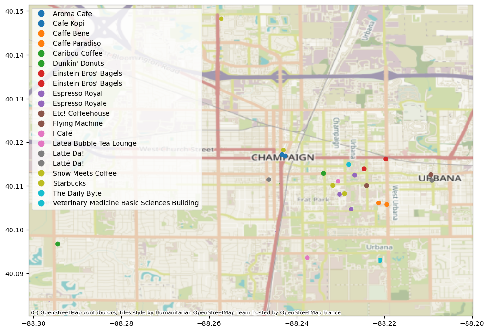

# Introduction to Osmosos and OSMFilter

**Author:** Alex Michels

This is a simple notebook walking through the usage of osmosis and OSMFilter for working with OpenStreetMap data. We also employ OSMNX for loading and visualization.

